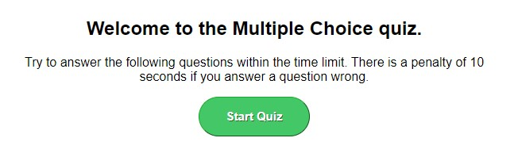
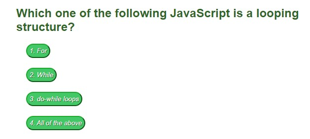
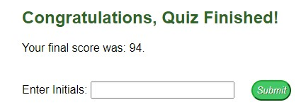
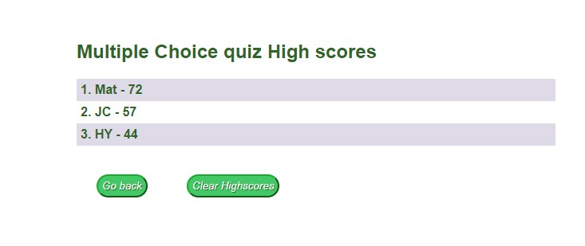

# Multiple Choice quiz

## Description

During your career you may be called on to do an assesment of coding to get a job, I created this so I can do a multiple choice quiz if required. I learnt how to use Javascript and webapi functionality in a website.

## Table of Contents

- [Installation](#installation)
- [Usage](#usage)
- [Credits](#credits)
- [License](#license)

## Installation

The Application has been deployed to the following website:

- https://breakfireaus.github.io/multiple-choice-quiz/

To start the Quiz just hit the start button and the quiz will start

## Usage

- Start page - To start the quiz hit the "Start Quiz" button

- Questions page - by selecting an option it will give you feedback straight away if you are correct or wrong.

- Quiz end - When you finish the quiz you can enter your initials to put your high score

- High Scores Page - You can view high scores and add yours when the quiz is finished

## Credits

- Ask BCS team @ Monash university Bootcamp
- Tutor for getting me on track
- https://www.w3schools.com/jsref/met_node_appendchild.asp
- https://www.w3schools.com/jsref/met_element_addeventlistener.asp
- https://www.w3schools.com/jsref/met_document_createattribute.asp
- https://www.w3schools.com/jsref/met_document_createelement.asp
- https://www.w3schools.com/jsref/met_document_getelementbyid.asp
- https://www.w3schools.com/js/js_json_parse.asp
- https://www.w3schools.com/js/js_api_web_storage.asp
- https://www.w3schools.com/js/js_htmldom_methods.asp

## License

MIT License

Copyright (c) 2022 breakfireaus

Permission is hereby granted, free of charge, to any person obtaining a copy
of this software and associated documentation files (the "Software"), to deal
in the Software without restriction, including without limitation the rights
to use, copy, modify, merge, publish, distribute, sublicense, and/or sell
copies of the Software, and to permit persons to whom the Software is
furnished to do so, subject to the following conditions:

The above copyright notice and this permission notice shall be included in all
copies or substantial portions of the Software.

THE SOFTWARE IS PROVIDED "AS IS", WITHOUT WARRANTY OF ANY KIND, EXPRESS OR
IMPLIED, INCLUDING BUT NOT LIMITED TO THE WARRANTIES OF MERCHANTABILITY,
FITNESS FOR A PARTICULAR PURPOSE AND NONINFRINGEMENT. IN NO EVENT SHALL THE
AUTHORS OR COPYRIGHT HOLDERS BE LIABLE FOR ANY CLAIM, DAMAGES OR OTHER
LIABILITY, WHETHER IN AN ACTION OF CONTRACT, TORT OR OTHERWISE, ARISING FROM,
OUT OF OR IN CONNECTION WITH THE SOFTWARE OR THE USE OR OTHER DEALINGS IN THE
SOFTWARE.
